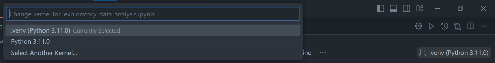

# diamond-price-prediction

## Prepare Virtual Environment
You can use anaconda, env or virtualenv instead of poetry.

### Install poetry
```
pip install poetry
```
for make .venv in the project file (to make it easy to use in VScode)
```
poetry config virtualenvs.in-project true
```

### Install requirement library
```
poetry install
```

### Change kernal


## Usage
Click start kernal and `run each cell` to see the result 
**or** `run all` to see all results.

## Contributors
- Kanyaluck&ensp;Chimchome [(Parefair)](https://github.com/Parefair)
- Boonyarit&ensp;Samran [(QuartzQw)](https://github.com/QuartzQw)
- Warisara&ensp;Patib [(Cocoa2304)](https://github.com/Cocoa2304)
- Chanidapa&ensp;Chanama [(Qandle)](https://github.com/Qandle)
- Nontawat&ensp;Kunlayawuttipong [(nontaxim)](https://github.com/nontaxim)
